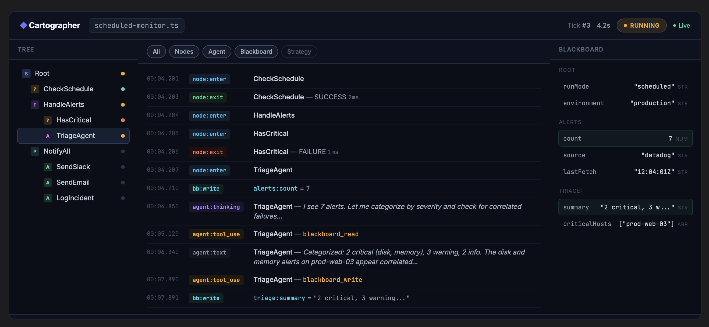

# Web Dashboard Design

Real-time observation dashboard for Cartographer behavior trees, served as a web application from the runner process.

## Context

Cartographer's Phase 2 roadmap originally planned a terminal TUI for real-time tree observation. After evaluating the tradeoffs, a web-based dashboard better serves the requirements: richer visualization, network accessibility for remote debugging, easier path to interactive controls, and a natural licensing boundary for future commercial use.

## Goals

1. **Real-time observation** (primary) — watch tree execution live, see node statuses update, monitor agent thinking as it happens
2. **Interactive control** (fast-follow) — pause, resume, abort, inject blackboard values
3. **Dev-first, ops-ready** — primarily a development tool for debugging and understanding tree behavior, with a path to production monitoring

## Architecture

Three layers with a strict HTTP API boundary between them:

### Runner (existing + HTTP layer)

`cartographer run my-tree.ts` does everything it does today, plus starts an HTTP server on a default port (e.g., `3147`). The server is always-on by default. A `--no-serve` flag disables it. A `--port` flag overrides the default port.

The runner's event emitter is the single source of truth. The HTTP layer subscribes to it the same way the CLI formatter already does — it's just another listener.

### HTTP API (the contract)

REST for state snapshots, SSE for the live event stream. This is the boundary. The dashboard never imports Cartographer internals. Any client that speaks HTTP can connect.

### Dashboard (Svelte SPA)

Pre-built at publish time via Vite, shipped as static assets in the npm package (e.g., `dist/dashboard/`). Served by the runner's HTTP server at `/`. Connects to the API on load, hydrates from REST endpoints, then subscribes to the SSE stream.

Bundled but lazy — the dashboard assets are only loaded/served when a request hits `/`. They do not affect `import { BehaviorTree } from 'cartographer'` or CLI startup performance.

## HTTP API

### REST Endpoints

| Method | Path              | Purpose                                                                                                                                                                |
| ------ | ----------------- | ---------------------------------------------------------------------------------------------------------------------------------------------------------------------- |
| `GET`  | `/api/tree`       | Tree structure — nodes, types, hierarchy, decorator params. Static after construction.                                                                                 |
| `GET`  | `/api/status`     | Run state — current tick status, tick count, duration, whether scheduled, schedule config.                                                                             |
| `GET`  | `/api/blackboard` | Full blackboard snapshot, including scoped keys with `:` prefixes.                                                                                                     |
| `GET`  | `/api/nodes/:id`  | Single node detail — status, last tick duration, agent config if AgentNode. Looked up by node `id` (unique), not `name` (which may collide). Returns 404 if not found. |
| `GET`  | `/`               | Serves the Svelte dashboard static assets.                                                                                                                             |

### Phase C: Interactive Control Endpoints

| Method | Path                   | Purpose                                                                                                       |
| ------ | ---------------------- | ------------------------------------------------------------------------------------------------------------- |
| `POST` | `/api/pause`           | Pause at scheduler level — prevents the next tick from starting. Does not suspend a tick already in progress. |
| `POST` | `/api/resume`          | Resume ticking after a pause.                                                                                 |
| `POST` | `/api/abort`           | Abort the current run.                                                                                        |
| `POST` | `/api/reset`           | Reset the tree.                                                                                               |
| `POST` | `/api/blackboard/:key` | Write a value to the blackboard. Request body: `{ "value": <any> }`.                                          |

### Error Responses

All REST endpoints return JSON error responses with a consistent shape:

```json
{ "error": "Not found", "status": 404 }
```

Standard status codes: `200` for success, `404` for unknown node/key, `400` for malformed request body, `409` for invalid state transitions (e.g., resume when not paused).

### SSE Stream

`GET /api/events` returns a Server-Sent Events stream. Event names match `TreeEvents` exactly. Payloads are serialized forms of the internal event data — non-serializable references (e.g., `BTreeNode`, `TreeContext`) are mapped to their serializable properties (node id, name, type, depth, status).

```
event: node:enter
data: {"node":{"id":"check-inv","name":"CheckInventory","type":"condition"},"depth":2,"ts":"..."}

event: agent:thinking
data: {"nodeId":"plan-action","text":"Let me consider...","ts":"..."}

event: tree:tick
data: {"status":"SUCCESS","durationMs":1234,"tickCount":1,"ts":"..."}
```

### Default Event Inclusion

All events are included in the SSE stream by default, with these exceptions:

| Excluded by default | Reason                                                                           | Opt-in          |
| ------------------- | -------------------------------------------------------------------------------- | --------------- |
| `agent:stream`      | Partial deltas — too noisy, content covered by `agent:text` and `agent:thinking` | `?verbose=true` |

All other `TreeEvents` are included: `node:enter`, `node:exit`, `node:error`, `agent:prompt`, `agent:thinking`, `agent:text`, `agent:tool_use`, `agent:response`, `agent:error`, `agent:message`, `agent:tool_progress`, `agent:init`, `agent:status`, `agent:rate_limit`, `agent:elicitation_declined`, `tree:init`, `tree:tick`, `tree:reset`, `tree:abort`, `blackboard:write`, `strategy:decision`.

### SSE Behaviors

- On connect, the server sends a synthetic `snapshot` event containing the current tree structure, blackboard state, and run status, so the dashboard can hydrate from the SSE stream alone.
- Each SSE message includes an incrementing `id:` field. Clients reconnecting with `Last-Event-ID` receive a fresh `snapshot` followed by any events they missed (if still in the server's buffer). If the buffer has been exceeded, a full snapshot is sent and the client resumes from there.
- Event names match `TreeEvents` exactly.

## Dashboard Panels

### Layout

Three-column layout with a collapsible bottom drawer:

- **Left column (~250px, resizable):** Tree panel.
- **Center column (flex):** Event timeline. Primary panel, gets the most space.
- **Right column (~300px, resizable):** Blackboard panel. Collapsible.
- **Bottom drawer (collapsed by default):** Node detail. Opens on node click.

### Header Bar

- Tree name and file path
- Run status badge (SUCCESS / FAILURE / RUNNING / PAUSED) with animated indicator
- Tick count
- Duration
- SSE connection status indicator (Live / Reconnecting)
- Phase C: pause / resume / abort buttons

### 1. Tree Panel

Live tree visualization showing node hierarchy. Each node displays:

- Type icon (color-coded: sequence, selector, parallel, action, condition, agent, decorator)
- Node name
- Current status indicator (green = SUCCESS, red = FAILURE, amber = RUNNING, gray = idle)

Clicking a node selects it, opening its detail in the bottom drawer and filtering the event timeline to that node.

### 2. Event Timeline

Chronological feed of all events in a unified stream:

- Node enter/exit with status and duration
- Agent thinking, text, tool calls, responses
- Blackboard writes with key and value
- Strategy decisions

Each entry is timestamped (relative to run start) and tagged by event type and source node. Filter bar at the top allows toggling event categories (Nodes, Agent, Blackboard, Strategy).

### 3. Blackboard Panel

Live key-value display of the blackboard. Updates in real-time on `blackboard:write` events:

- Keys grouped by scope (namespace prefix before `:`)
- Values shown with type indicator (str, num, arr, obj, bool)
- Recently updated entries highlighted briefly

### 4. Node Detail Panel

Bottom drawer, expands on node selection:

- **AgentNode:** model, tools, MCP servers, prompt, output schema, current status, elapsed time
- **Composites:** strategy config, children list
- **All nodes:** last tick status, duration, tick history

### Interactions

- Click a node in the tree panel to select it — opens detail drawer and filters timeline
- Click again or clear button to deselect and show full unfiltered timeline
- Panel dividers are draggable for resize
- Panels are collapsible via header toggle

### Responsive Behavior

- Below a breakpoint, right column collapses into a tab alongside the timeline
- Tree panel becomes a top horizontal bar with breadcrumb-style path

## Visual Design

Professional, information-dense design consistent with leading infrastructure tools (Datadog, Grafana, Databricks). Dark theme with:

- Deep navy background (`#0a0e17`)
- Subtle panel borders (`#1e2a3a`)
- High-contrast text hierarchy (white headers, gray body, muted timestamps)
- JetBrains Mono for all code/data values
- Inter for UI text
- Color-coded event tags and node type icons
- Purposeful use of accent colors — no gratuitous gradients or decorative elements

Dashboard Draft Design: ./dashboard-layout.html
Screenshot located here: 

## Technology Stack

- **Dashboard:** Svelte (SPA), Vite (build)
- **Communication:** REST (hydration + control), SSE (live event stream)
- **Runner HTTP server:** Node.js built-in `http` module (or lightweight framework if warranted)
- **Build:** Pre-built at `npm run build` time, static assets shipped in `dist/dashboard/`

## Delivery

The dashboard ships in the same `cartographer` npm package. It is bundled but lazy — dashboard assets are served only when requested. The existing CLI text/JSON/quiet formatters continue working exactly as today. The dashboard is purely additive.

## Future Considerations

- **Licensing gate:** The dashboard command or static asset serving can be gated behind a license check when Cartographer moves to a commercial model. The HTTP API boundary makes this straightforward — the API itself can remain open while the UI is gated.
- **Package extraction:** If needed later, extracting the dashboard into a separate `@cartographer/dashboard` package is a low-effort task because the dashboard only communicates via the HTTP API, never importing Cartographer internals.
- **VS Code extension:** The same HTTP API could power a VS Code sidebar panel.
- **Post-mortem analysis:** Run history storage and replay could be added by recording the SSE event stream to a file (similar to the existing `TreeLogger`) and replaying it through the dashboard.
